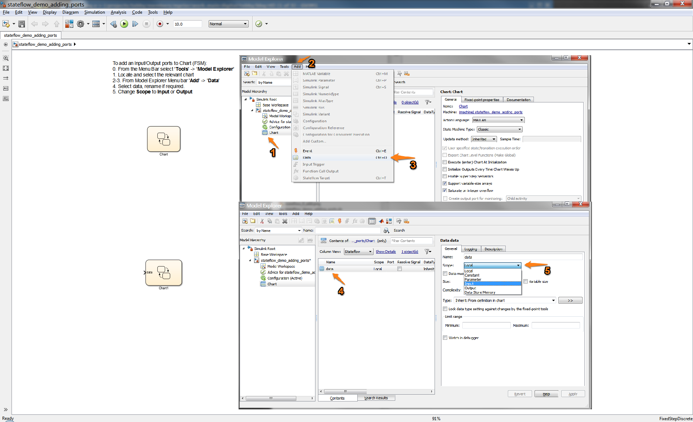

Stateflow Adding Ports
==

Tutorial on adding ports to stateflow charts.

To add an Input/Output ports to Chart (FSM):

0) From the Menu Bar select '**Tools**' -> '**Model Explorer**'.  
1) Locate and select the relevant chart.  
2-3) From Model Explorer Menu bar '**Add**' -> '**Data**'.    
4) Select data, rename if required.  
5) Change **Scope** to **Input** or **Output**.  

